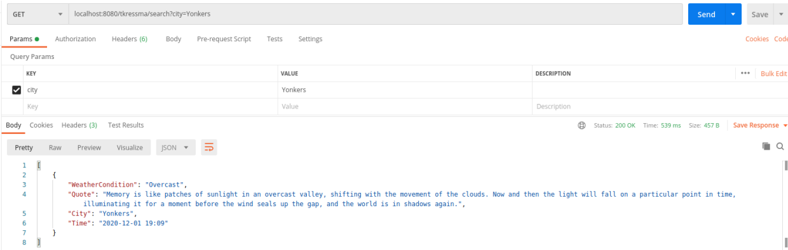
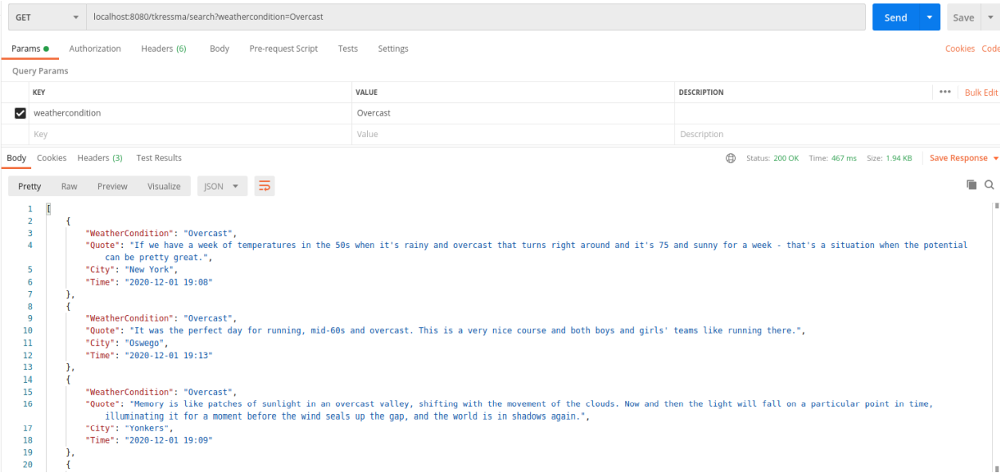
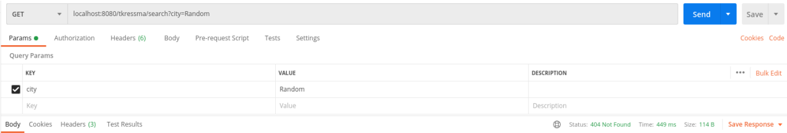
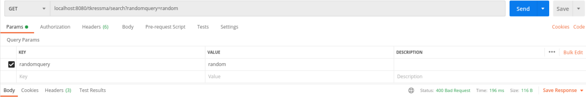

# WeatherQuotes RESTful API
This RestAPI was built with Golang using Postman, Loggly, Portainer, Docker, as well as a suite of AWS products for hosting and managing the microservice API, specifically the Simple Storage Service (S3), CodeBuild, ECR, ECS, CodePipeline, and Fargate.

 

## Endpoints

| Endpoint |    HTTP Method   |      Action      |
|--------------|-----------|----------------|
| */all         | GET | Returns all JSON elements produced |
| */search         | GET| Returns all JSON matching either 'city' or 'weathercondition'. Returns 404 if no results are returned. Returns 400 if an improper search query is used (E.G. '/tkressma/search/randomquery=random') |
| */status        | GET| Returns the status     |

 
<h3> Postman screenshots for /search endpoint </h3>
*/tkressma/search?city=Yonkers

*/tkressma/search?weathercondition=Overcast

*/tkressma/search?city=Random, returns 404 as there are no results for the search.

*/tkressma/search?randomquery=random, returns 400 as there is no such search query

To make go deps "go mod init <projname.go> " and "go mod tidy"  needs to be ran
this generates a go.mod file which has dependencies and a go.sum which stores the versions of the dependencies
"go mod download" downloads dependencies on any system. These go programs can be compiled into native binaries for the target system and architecture.
